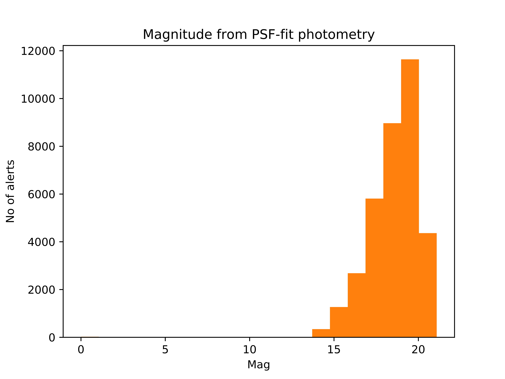
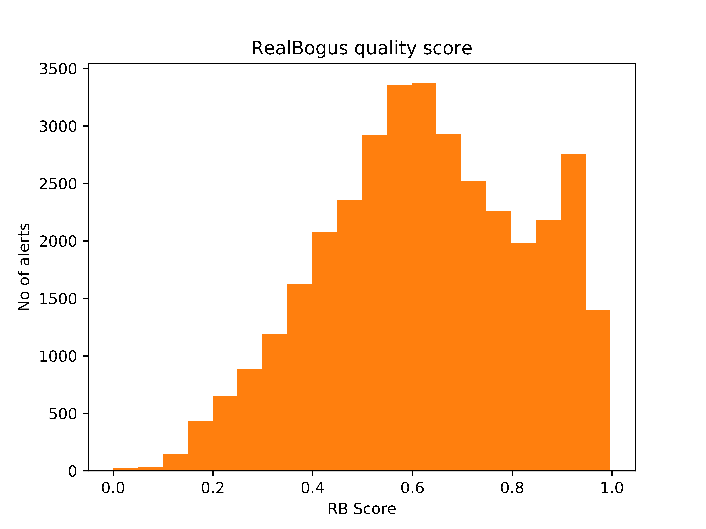
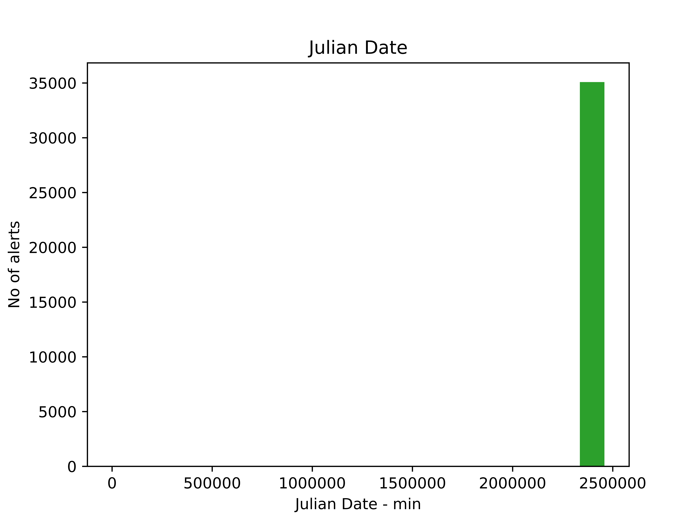
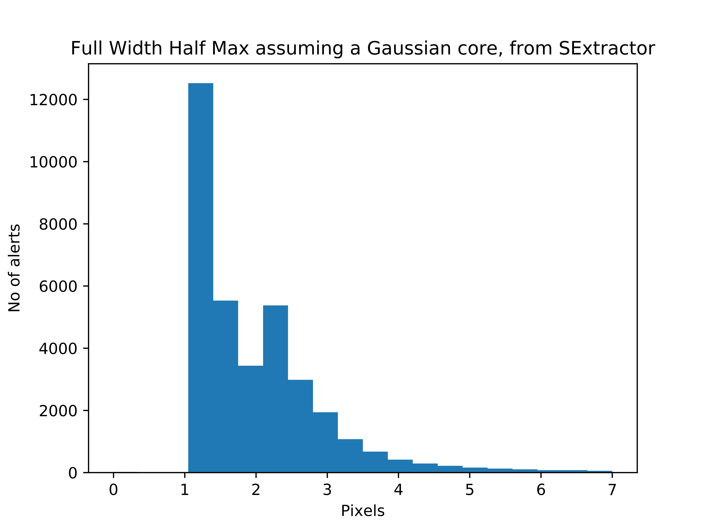

# ZTF — Transient alerts around the Andromeda Galaxy (M31)

> A small 2020 astronomy data-analysis project that downloads transient
> [Zwicky Transient Facility][ztf] alerts in a cone around the Andromeda
> Galaxy (M31), characterises them, and maps them back onto the sky.


> [!NOTE]
> This repository is an **archived** record of an early personal project,
> written in 2020 before I had any LLM assistance. It has been reorganised
> and documented for posterity; the analysis itself is preserved as it was.

---

## Background

The **[Zwicky Transient Facility (ZTF)][ztf]** is a wide-field sky survey
that scans the northern sky every couple of nights. Whenever a source
changes brightness, ZTF issues an *alert* — a packet describing the detection.
These alerts are served by *brokers*; this project queried the
**[MARS][mars]** broker (`mars.lco.global`) operated by Las Cumbres Observatory.

This project pulls every alert in a small cone centred on **M31**, the
Andromeda Galaxy, and asks some basic questions: how bright are the
detections, how real are they, when did they happen, and where on the sky
do they sit?

## What it does

1. **Fetch** — page through the MARS broker's JSON for a 1.5° cone search on
   M31 and pull out the candidate properties of every alert
   ([`src/alerts.py`](src/alerts.py)).
2. **Plot** — histogram the magnitude, RealBogus score, observation date and
   image quality of those alerts ([`src/plot.py`](src/plot.py)).
3. **Map** — convert alert sky coordinates to image pixel coordinates with a
   WCS and visualise their spatial distribution
   ([`src/fits.py`](src/fits.py)), and export a [DS9][ds9] region file so the
   alerts can be overlaid on the real FITS science images
   ([`src/textprinter.py`](src/textprinter.py)).

## The dataset

The collected sample lives in [`data/arrays/`](data/arrays) as one NumPy
array per property. Summary, recomputed from the committed data:

| Property            | Value                                                  |
| ------------------- | ------------------------------------------------------ |
| Alerts collected    | **35,077**                                             |
| Observation span    | 2018-07-13 → 2020-02-26 (JD 2458312.97 – 2458905.64)   |
| Magnitude (`magpsf`)| 13.35 – 21.09                                          |
| RealBogus (`rb`)    | 0.05 – 1.00                                            |
| FWHM (median)       | 1.69 px                                                |
| Sky region          | RA 8.69°–12.67°, Dec 39.77°–42.77° (around M31)        |
| Filters             | ZTF-*g* (14,902 alerts), ZTF-*r* (20,175 alerts)       |

Each array holds one of these per-alert fields:

| Array        | Meaning                                                       |
| ------------ | ------------------------------------------------------------ |
| `ra`, `dec`  | Sky position (degrees)                                        |
| `xpos`,`ypos`| Source position on the image (pixels)                         |
| `magpsf`     | Magnitude from PSF-fit photometry                            |
| `sigmagap`   | 1-σ uncertainty on the magnitude                            |
| `rb`         | RealBogus score — ML estimate of real (1) vs. artefact (0)  |
| `fwhm`       | Full-width half-max of the source (pixels)                   |
| `fid`        | Filter ID (1 = ZTF-*g*, 2 = ZTF-*r*)                        |
| `distnr`     | Distance to nearest reference-image source (pixels)          |
| `jd`         | Julian date of the observation                               |

The FITS science images used for the spatial mapping are in
[`data/images/`](data/images), including the original ZTF science image
(`ztf_..._sciimg.fits`), a centred cutout, and a DS9 region file.

## Results

Distributions of the ~35k alerts:

| Magnitude (PSF) | RealBogus score |
| :---: | :---: |
|  |  |
| **Observation date** | **Image quality (FWHM)** |
|  |  |

## Repository layout

```
ZTF/
├── src/                     # analysis scripts
│   ├── alerts.py            #  1. download alerts from the MARS broker
│   ├── plot.py              #  2. histogram the alert properties
│   ├── fits.py              #  3. map alerts onto image pixels (WCS) — exploratory
│   └── textprinter.py       #     export a DS9 region file of alert positions
├── data/
│   ├── arrays/              # the collected dataset (one .npy per property)
│   └── images/              # FITS science images + DS9 region file
├── figures/                 # output histograms (PNG)
├── docs/                    # project notes + original DIARY.docx
├── requirements.txt
├── LICENSE
└── README.md
```

## Running it

```bash
pip install -r requirements.txt

python src/alerts.py        # re-download alerts -> data/arrays/  (~27 min, needs network)
python src/plot.py          # regenerate the histograms -> figures/
python src/textprinter.py   # write coord.txt (DS9 regions) from ra/dec
python src/fits.py          # WCS pixel-mapping plot (opens a window)
```

The committed `data/arrays/` already contains the 2020 sample, so `plot.py`,
`textprinter.py` and `fits.py` all run without re-downloading anything.

## Notes & limitations (2020)

From the original project diary (see [`docs/notes.md`](docs/notes.md)):

- The sample is **not exhaustive** — the bulk JSON API couldn't be used, so
  alerts were paged one request at a time, making a full run take ~27 minutes.
- Full-resolution FITS images were downloaded for inspection but ran into
  disk-space limits.
- `src/fits.py` is exploratory scratch work: it keeps several alternative
  approaches as comments (reading the WCS straight from a FITS header, DBSCAN
  clustering of pixel positions) and its WCS setup is a rough placeholder.

## License

[MIT](LICENSE) © 2020 Kunal Bhatia.

[ztf]: https://www.ztf.caltech.edu/
[mars]: https://mars.lco.global/
[ds9]: https://sites.google.com/cfa.harvard.edu/saoimageds9
